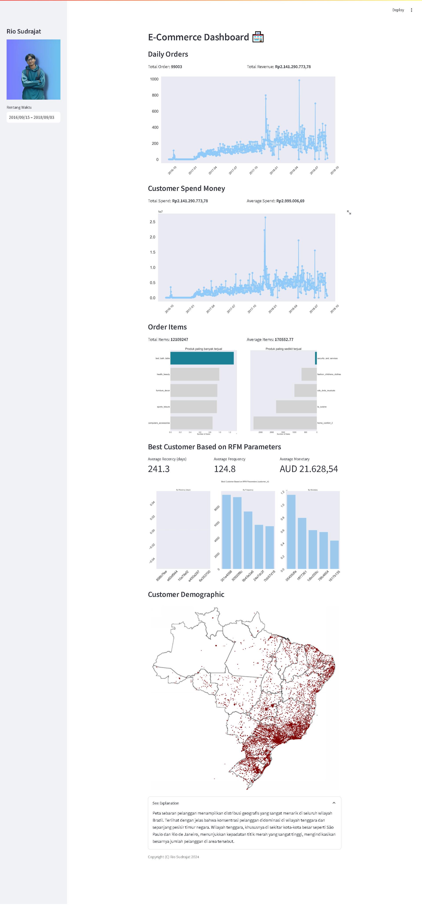

# Submission Dicoding "Belajar Data Analytics dengan Python"

## Project Data Analytics

Repository ini berisi proyek data analytics yang saya kerjakan dari dicoding. Deployment in **Streamlit** </img>

## Deskripsi

Proyek ini bertujuan untuk mengeksplorasi dan menganalisis data dari E-Commerce Public Dataset guna mengungkap wawasan berharga yang dapat mendukung pengambilan keputusan strategis. Dengan pendekatan berbasis data, proyek ini akan memanfaatkan berbagai teknik analisis dan visualisasi data untuk:

Mengidentifikasi Pola Konsumen: Memahami perilaku pelanggan berdasarkan data pembelian, preferensi produk, dan waktu transaksi.
Menganalisis Performa Penjualan: Mengungkap tren penjualan, produk terlaris, dan kontribusi kategori produk terhadap pendapatan.
Mengoptimalkan Proses Bisnis: Memberikan rekomendasi berbasis data untuk meningkatkan efisiensi operasional dan kepuasan pelanggan.
Hasil akhir dari proyek ini adalah laporan yang menyajikan wawasan yang diperoleh, termasuk grafik dan visualisasi yang mendukung, serta rekomendasi strategis untuk meningkatkan kinerja di sektor e-commerce.

## Struktur Direktori

- **/data**: Direktori ini berisi data yang digunakan dalam proyek, dalam format .csv .
- **/dashboard**: Direktori ini berisi main.py yang digunakan untuk membuat dashboard hasil analisis data.
- **Proyek_Analisis_Data_E_Commerce.ipynb**: File ini yang digunakan untuk melakukan analisis data.

## Instalasi

1. Clone repository ini ke komputer lokal Anda menggunakan perintah berikut:

   ```shell
   git clone https://github.com/Mazwan98/dicoding.git
   ```

2. Pastikan Anda memiliki lingkungan Python yang sesuai dan Library yang diperlukan. Anda dapat menginstal Library tersebut dengan menjalankan perintah berikut:

   ```shell
   pip install streamlit
   pip install -r dashboard/requirements.txt
   ```

## Penggunaan

1. Masuk ke direktori proyek (Local):

   ```shell
   cd dicoding/dashboard/
   streamlit run main.py
   ```

   Atau bisa dengan kunjungi website ini [Project Data Analytics](https://e-comercedataanalyst-7btv4kty725svtuysyrqh3.streamlit.app/)

   </img>

## Kontribusi

Anda dapat berkontribusi pada proyek ini dengan melakukan pull request. Pastikan untuk menjelaskan perubahan yang Anda usulkan secara jelas dan menyeluruh.
